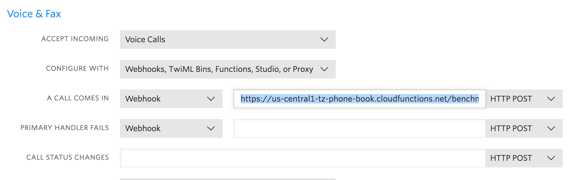

# VoiceBook

A demo application for an IVR based social network.

## Installation

Prerequisites:
- firebase cli tools `npm install -g firebase-tools`
- localtunnel `npm install -g lt`

Steps:  
```bash
#Login to your firebase account
firebase login

#List your projects, and check for a the tz-phone-book project:
#If you can't see an entry called 'tz-phone-book', contact Lewis to get you access
firebase list


#Install node modules
cd functions 
yarn
```

## Running Locally:

```bash
#First, we run localtunnel to expose our local webserver publicly:
./_run_lt.sh

#then, in a separate terminal session, run:
./run_local.sh

#This runs the firebase functions in a firebase emulation mode.
```

[todo: talk about node version issues]
[todo: talk about base url stuff]


## Deployment

1. Start by ensuring you have the correct environment variables setup:

You need a `.env.sh` file in `./env`, which contains the following:
```bash
#Put private env vars here.
export TWILIO_ACCOUNT_SID='<insert_me>'
export TWILIO_AUTH_TOKEN='<insert_me>'
```

and the BASE_URL entry in `env.sh` should point to the firebase endpoint:
```bash
export BASE_URL="https://us-central1-tz-phone-book.cloudfunctions.net"
```

2. Run the deployment script.

```bash
./_deploy.sh
```
This script sets the environment variables we set up earlier, and then deploys the firebase functions


3. Now we just need to point our Twilio number to our deployment.   
Log into Twilio > Programmable Voice > Numbers > Manage Numbers > Select a Number >
Under 'Voice & Fax' > 'A Call Comes In', set to the entrypoint url for the firebase function  
eg:`https://us-central1-tz-phone-book.cloudfunctions.net/benchmark/entrypoint`




----
## Firebase Api: [DEPRECTATED]

### 1.0 `POST /message`

Creates a new message, and saves to cloud store

Request:
```js
{
  "audioUrl": "string",       //the url to the twilio recording
  "phone": "string"           //international format
}
```


Response:
```js
{
  "id":"string" //the id of the saved message in firestore
}
```

For example:

```bash
curl -X POST \
  http://localhost:5000/tz-phone-book/us-central1/message \
  -H 'Content-Type: application/json' \
  -d '{
  "audioUrl": "https://api.twilio.com/2010-04-01/Accounts/ACc628835716a7f404b36a44114e05719b/Recordings/RE33899fd6eaaf8506f41b3a586599253d.mp3",
  "phone":"12345"
}'
```


### 2.0 `GET /recents`

Gets the 5 most recent messages, in descending date order

Request:

params:

Response:

**note: the root json object must be a JSON dict in order for twilio to parse it correctly**

```js
{
  "messages":
  [
    {
      "id":"string",
      "createdAt": "string", //ISO Format date
      "audioUrl": "string", 
    } 
    //...
  ]
}
```


For example:

```bash
curl http://localhost:5000/tz-phone-book/us-central1/message \
  -H 'Content-Type: application/json'
```


http://localhost:5000/tz-phone-book/us-central1/message?stringFormat=true


## Development:

### Terms:

- __Block__: A block is a collection of commands which get converted to TwiML
- __Message__: A message is a 'say' or 'play' containing either text to be said, or a url pointing to an audio file to be played
- __Flow__: A flow describes the relationship between different blocks


## Configuring twilio url:

Example url for ngrok: `http://4e27e9ad.ngrok.io/tz-phone-book/us-central1/benchmark/entrypoint
`

Example request for localtunnel:
`curl -X POST "https://lwilld3.localtunnel.me/tz-phone-book/us-central1/twiml/entrypoint"`

Benchmark url for Firebase deployment `https://us-central1-tz-phone-book.cloudfunctions.net/benchmark/entrypoint`


## Handy Snippets

### Convert audio with ffmpeg

```bash
ffmpeg benchmark_test_3.mp3 -i benchmark_test_3.m4a -codec:a libmp3lame -qscale:a 1
```


### Testing locally with curl:

```bash
curl -X POST \
  https://lwilld3.localtunnel.me/tz-phone-book/us-central1/twiml/intro_0 \
  -H 'Postman-Token: d1ec563e-975d-4860-bc54-a4cdf8c5a45c' \
  -d '{
	"From":"+61410237238"
}'
```